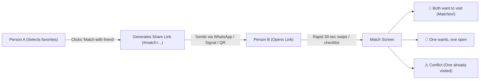

# Proposal: Personal Prioritization Buckets & Zero-Account "Museum Matchmaker"

## 1. Executive Summary

Museumwijzer currently allows users to save museums into a flat favorite list (`localStorage`) and mark museums as visited. However:
1. **Prioritization within a long list is hard:** Having 25 favorites without clear tiers (e.g. *"Must visit next weekend"* vs *"Someday when I'm in Groningen"*) leads to decision paralysis.
2. **Aligning with a partner/friend is friction-heavy:** When two or more people want to go somewhere together, they currently have to send links back and forth or read names aloud. Traditional solutions require user accounts, passwords, and a backend database — which adds maintenance overhead, hosting costs, and privacy concerns.

This document proposes a **100% client-side, zero-account, zero-cost solution** divided into two phases:
- **Phase 4A: Priority Buckets & Fluid Reordering** (Single-user organization)
- **Phase 4B: Museum Matchmaker** (Multi-person alignment via URL fragment sharing)

---

## 2. Feature 4A: Priority Buckets & Fluid Reordering

### 2.1 The 4 Priority Buckets
Instead of a single binary favorite toggle, users can place museums into clear priority tiers:

| Bucket | Icon | Dutch Label | Description |
|---|---|---|---|
| **Must Visit** | 🎯 | *Bovenaan de lijst* | High priority; planned for upcoming weeks or next trip. |
| **Interested** | ⭐ | *Interessant* | Solid interest; visit when in the area. |
| **Maybe Later** | 💡 | *Ooit / Misschien* | Nice to have, rainy day backups, lower priority. |
| **Visited** | ✅ | *Al bezocht* | Completed visits. Retained for personal visit history. |

### 2.2 User Experience & Interactions
1. **On Catalogue Cards:**
   - Tapping the existing heart icon sets the museum to **Must Visit** by default.
   - A subtle dropup/popover or long-press lets the user immediately choose: `🎯 Must` / `⭐ Interested` / `💡 Maybe`.
2. **In the "Mijn Lijst" View:**
   - Tabs or collapsible accordion sections for each bucket: `🎯 Must Visit (4)`, `⭐ Interested (12)`, `💡 Maybe Later (7)`, `✅ Visited (15)`.
   - **Reordering UX:**
     - **Touch-friendly up/down buttons** (`▲` / `▼`) for reliable, accessible mobile reordering.
     - **Drag handles** (`⋮⋮`) for fluid desktop drag-and-drop.
     - **Move to bucket dropdown** to quickly promote or demote items with one tap.

### 2.3 Storage Architecture (`localStorage`)
Backwards-compatible data migration:
```json
{
  "version": 2,
  "buckets": {
    "must": ["rijksmuseum", "nemo-science-museum"],
    "interested": ["spoorwegmuseum", "teylers-museum"],
    "maybe": ["museum-more"],
    "visited": ["anne-frank-huis"]
  }
}
```
*Existing `museum_list` arrays are automatically migrated into the `must` bucket on first load without losing any user data.*

---

## 3. Feature 4B: Zero-Account "Museum Matchmaker"

### 3.1 The Concept
Allow 2 (or more) people to find their overlapping museum interests in **under 60 seconds**, without creating an account, logging in, or saving any personal data on a server.



### 3.2 Technical Architecture: Why Zero Backend?
- **Zero cost & zero maintenance:** No database, no auth tokens, no API quotas, no hosting expenses.
- **100% Privacy & GDPR compliant:** No email addresses, phone numbers, or visit records ever touch an external server.
- **URL Fragment Encoding (`#match=...`):**
  - Modern browsers **never send URL fragments (the part after `#`) to the web server**.
  - This guarantees that even web server logs cannot track what museums users are comparing.
  - Links are compact: 30 museum IDs compressed with lz-string or binary bitset result in a URL shorter than 120 characters!

#### Example URL:
```text
https://museumwijzer.vlesyk.com/nl/match/#v1=eJyLzivNydFRykwpys...
```

### 3.3 The Two Scenarios for Person B (The Partner)

#### Scenario 1: Person B already uses Museumwijzer
- Person B opens Person A's link.
- Museumwijzer compares Person A's `localStorage` data with Person B's `localStorage` data automatically.
- Instantly presents the **Match Results Screen**.

#### Scenario 2: Person B is a first-time visitor (Frictionless Onboarding)
- Person B does **not** have a list and doesn't want to browse 200 museums.
- The link opens a **"Rapid Match Mode"** showing **only the museums Person A likes**:
  > *"Viktor picked 8 museums. Which ones are you in for?"*
- Person B sees a clean card for each with 3 simple tap options:
  - 💚 **"Ja, leuk!"** (Yes!)
  - 🤔 **"Misschien"** (Maybe)
  - ❌ **"Nee / Al gezien"** (No / Already seen)
- Takes less than 30 seconds to complete!

### 3.4 The Match Results Screen

| Category | Indicator | What it means | Example |
|---|---|---|---|
| **Top Matches** | 💚 100% Match | Both selected as *Must Visit*. | *Rijksmuseum* |
| **Good Compromises** | 💛 Shared Interest | One *Must Visit*, one *Interested* or *Maybe*. | *Teylers Museum* |
| **Solo Exploration** | 🤍 One-sided | Person A loves it, Person B skipped it. | *Spoorwegmuseum* |
| **Visit Conflicts** | ⚠️ Already Visited | Person A wants to visit, but Person B already marked it as *Visited*. | *Anne Frank Huis* (Warning banner: *"Partner already visited"*) |

### 3.5 Actionable Next Steps from the Match Screen
1. **"Save Matched List":** Saves the shared matches directly into a designated "Shared Trips" section in Person B's device.
2. **"Share Final Plan":** Generates a simple text itinerary for WhatsApp:
   > *"🏛️ Our Museum Day shortlist: Rijksmuseum + Teylers Museum! Book tickets here: https://museumwijzer.vlesyk.com/..."*

---

## 4. Rollout Strategy & Phasing

- **Phase 4A (Next Phase):**
  - Implement the 4 Priority Buckets in `localStorage`.
  - Add bucket selector to museum cards.
  - Upgrade the `Mijn lijst` page with bucket groups and accessible mobile reordering.
- **Phase 4B (Following Phase):**
  - Implement URL hash compression / decompression engine.
  - Build the `/match/` interactive comparison & 30-second rapid swipe review.
  - Add "Match with a friend" export button to `Mijn lijst`.

---

## 5. Decision Request
Do you approve this architecture for Phase 4A and Phase 4B?
Once confirmed, we can implement Phase 4A first, test thoroughly, and then proceed with Phase 4B.
